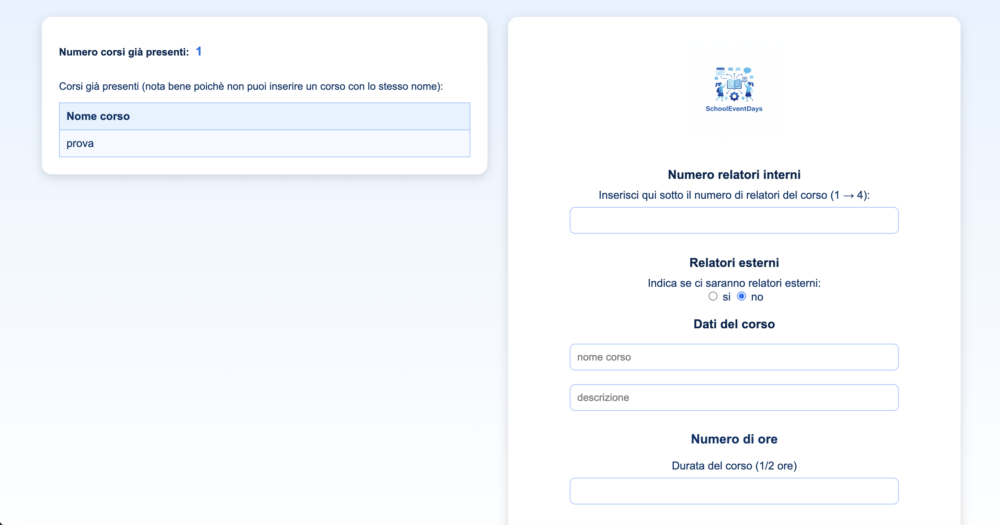
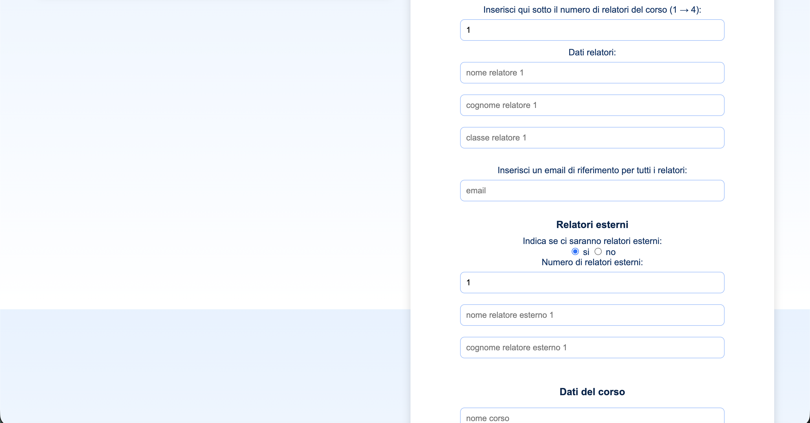
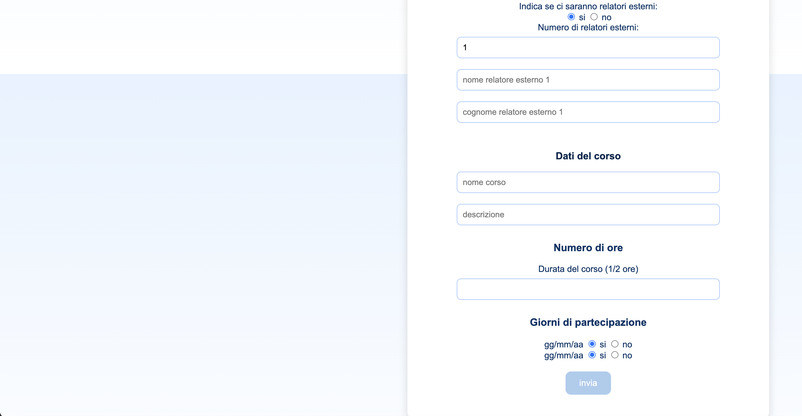
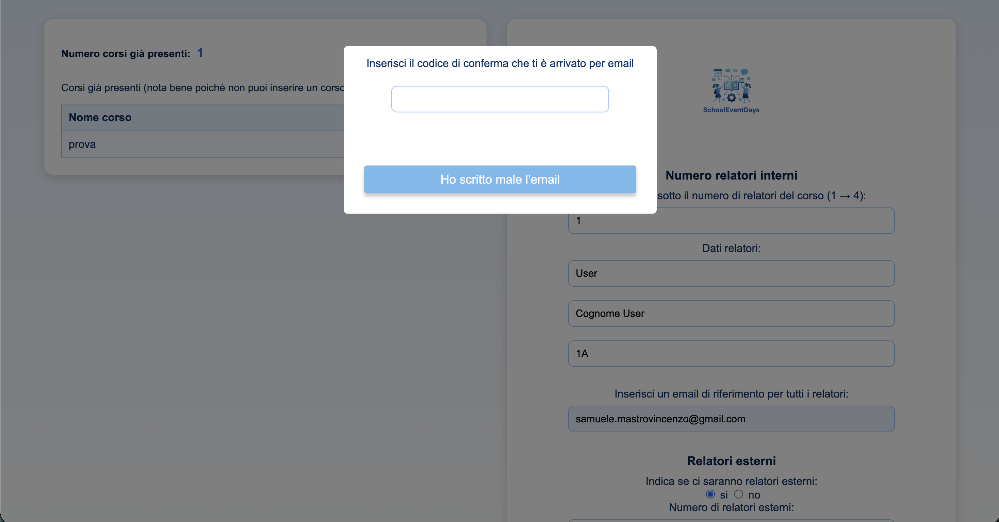
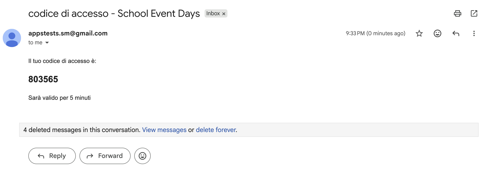
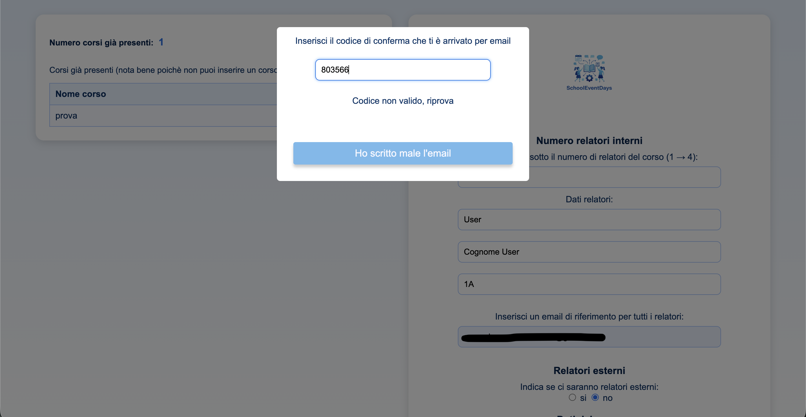
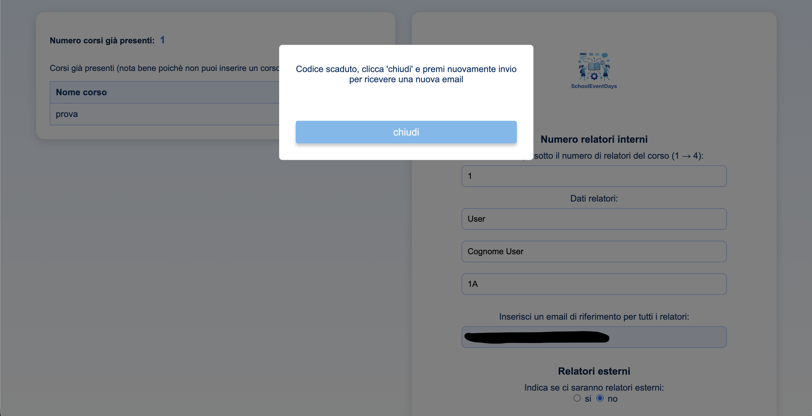
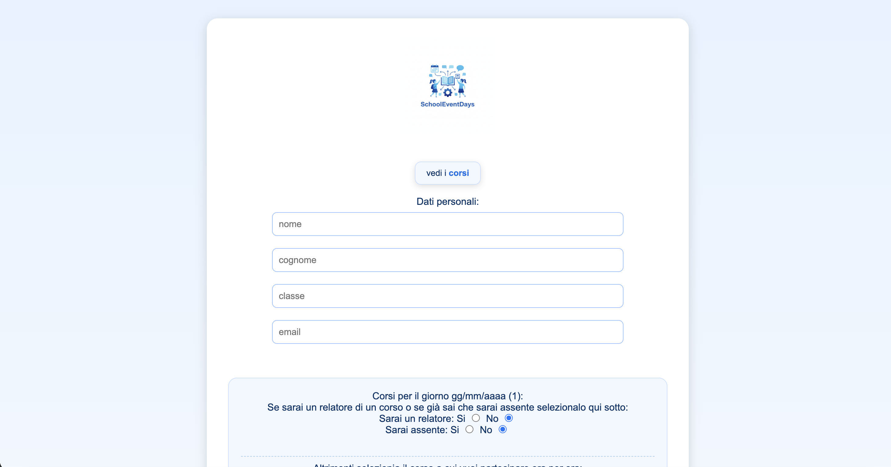
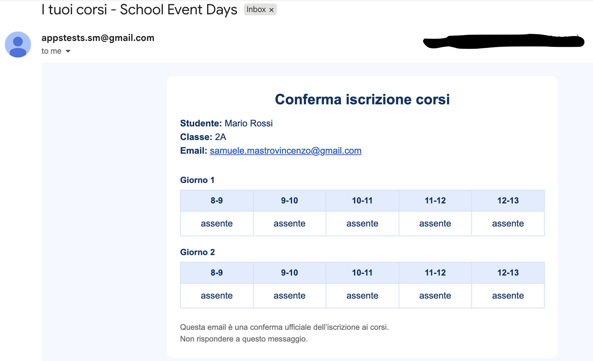
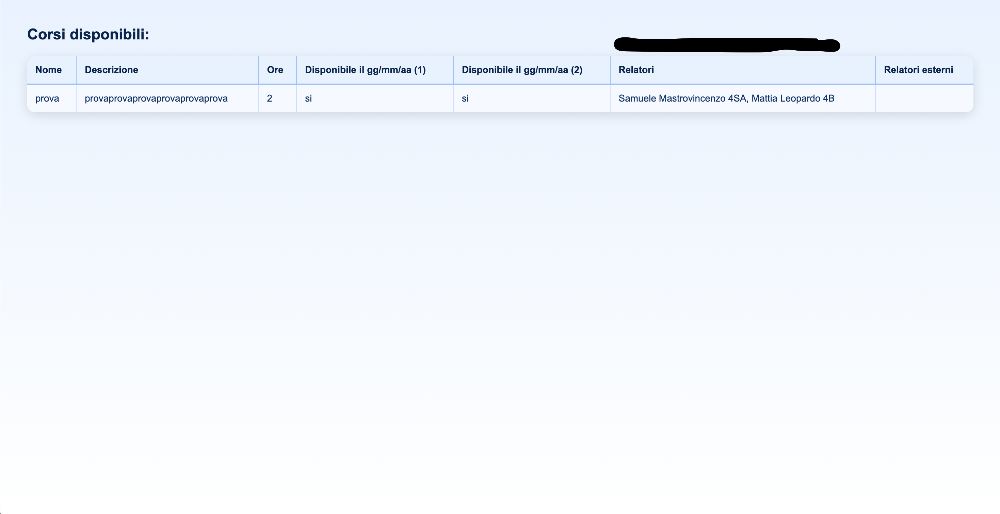

# 📚 SchoolEventDays - Event Registration System

Sistema di gestione eventi su due giorni con registrazione sessioni orarie, verifica email OTP, aggiornamenti real-time tramite WebSocket, e dashboard admin protetta.













## 📋 Indice
- [Caratteristiche](#-caratteristiche)
- [Tecnologie](#️-tecnologie)
- [Prerequisiti](#-prerequisiti)
- [Installazione](#-installazione)
- [Configurazione](#️-configurazione)
- [Utilizzo](#-utilizzo)
- [Admin Dashboard](#-admin-dashboard)
- [Struttura del progetto](#-struttura-del-progetto)
- [WebSocket Events](#-websocket-events)
- [Security Features](#️-security-features)
- [Deploy](#-deploy)
- [Autore](#-autore)
- [Licenza](#-licenza)

## ✨ Caratteristiche

### Core Features
- ✅ **Creazione Corsi** con verifica email OTP (6 cifre)
- ✅ **Registrazione Studenti** a sessioni orarie personalizzabili
- ✅ **Eventi su 2 giorni** con 5 ore per giorno
- ✅ **Email di conferma** automatica post-registrazione
- ✅ **Gestione posti disponibili** real-time
- ✅ **WebSocket** per aggiornamenti live della disponibilità
- ✅ **Supporto corsi multi-ora** (1, 2, 4, 5 ore)
- ✅ **Referenti multipli** (fino a 4 interni + esterni)
- ✅ **Rate limiting** per protezione da spam
- ✅ **Dashboard Admin** protetta per visualizzazione dati

### Email System
- 📧 **Email OTP** per verifica creazione corso (6 cifre, 5 min validità)
- 📧 **Email conferma** registrazione con riepilogo corsi scelti
- 📧 **Template HTML** responsive e professionali
- 📧 **API HTTP** con Resend API Key

### Real-time Updates
- ⚡ **WebSocket** per comunicazione bidirezionale
- ⚡ **Aggiornamenti live** posti disponibili
- ⚡ **Auto-refresh** lista corsi quando posti si esauriscono

### Admin Dashboard
- 🔐 **Accesso protetto** con password e rate limiting
- 📊 **Visualizzazione corsi** con tutti i dettagli e posti disponibili
- 👥 **Visualizzazione iscrizioni** separate per giorno 1 e giorno 2
- 🔒 **SHA256 password hashing** per sicurezza
- ⏱️ **Rate limiting avanzato** (3 tentativi / 30 minuti)

## 🛠️ Tecnologie

### Backend
- **Node.js** (v18+) - Runtime JavaScript
- **Express.js** (v5.2.1) - Web framework
- **MySQL2** (v3.16.0) - Database relazionale
- **WebSocket (ws)** (v8.18.3) - Comunicazione real-time
- **Redis** (v5.11.0) - Cache e rate limiting store
- **Resend** (v6.9.3) - Invio email
- **express-rate-limit** (v8.2.1) - Rate limiting middleware
- **dotenv** (v17.2.3) - Environment variables
- **crypto** (built-in) - Password hashing SHA256

### Frontend
- **HTML5/CSS3** - Markup e styling
- **JavaScript Vanilla** - Logica client-side
- **WebSocket API** - Connessione real-time

### Development
- **Nodemon** (v3.1.11) - Auto-restart su modifiche

## 📦 Prerequisiti

Prima di iniziare, assicurati di avere installato:

- [Node.js](https://nodejs.org/) v18 o superiore
- [MySQL](https://www.mysql.com/) v8 o superiore
- [Redis](https://redis.io/) v6 o superiore (per rate limiting)
- [Git](https://git-scm.com/) per clonare il repository
- Account Resend per invio email (con API Key)

### Verifica installazioni
```bash
node --version  # v18.0.0+
npm --version   # v9.0.0+
mysql --version # v8.0.0+
redis-server --version # v6.0.0+
```

## 🚀 Installazione

### 1. Clona il repository
```bash
git clone https://github.com/samueleee1016/SchoolEventDays.git
cd SchoolEventDays
```

### 2. Installa le dipendenze
```bash
npm install
```

### 3. Configura il database MySQL

Crea il database e importa lo schema:
```bash
# Accedi a MySQL
mysql -u root -p

# Crea il database
CREATE DATABASE SchoolEventDays;
USE SchoolEventDays;

# Importa lo schema
source schema.sql;
```

### 4. Avvia Redis
```bash
# macOS (con Homebrew)
brew services start redis

# Linux
sudo systemctl start redis

# Windows (con installer)
redis-server

# Verifica che Redis sia attivo
redis-cli ping
# Risposta: PONG
```

### 5. Configura Resend per invio email

**Crea API Key per Resend:**
1. Vai su https://resend.com/api-keys
2. Crea un nuovo progetto (o usa esistente)
3. Genera una API Key
4. Copia la API Key (formato: `re_...`)
5. Usa questa API Key in `.env`

## ⚙️ Configurazione

### Crea il file .env

Copia il file `.env.example` e rinominalo in `.env`:
```bash
cp .env.example .env
```

Modifica il file `.env` con le tue configurazioni:

```env
# ================================
# DATABASE CONFIGURATION
# ================================
DB_HOST=localhost
DB_USER=root
DB_PASSWORD=your_mysql_password
DB_DATABASE=SchoolEventDays
DB_PORT=3306
DB_WAITFORCONNECTIONS=true
DB_CONNECTION_LIMIT=10
DB_QUEUE_LIMIT=0

# ================================
# SERVER CONFIGURATION
# ================================
SERVER_PORT=3000

# ================================
# EMAIL CONFIGURATION (RESEND)
# ================================
# Get your API key from: https://resend.com/api-keys
RESEND_API_KEY=re_your_resend_api_key_here

# ================================
# ADMIN DASHBOARD CONFIGURATION
# ================================
# Admin password for accessing protected dashboard
# MUST be exactly 9 characters long
ADMIN_PASSWORD=your_secure_9_char_password
ADMIN_PASSWORD_LENGTH=9
```

### ⚠️ Note sulla sicurezza
- **NON** committare mai il file `.env` su Git
- Usa API Key Resend dedicata per produzione
- Cambia le password di default del database
- Usa password admin complessa (9 caratteri con lettere, numeri, simboli)
- In produzione, usa valori diversi per ogni ambiente

## 💻 Utilizzo

### Avvia l'applicazione

```bash
# Development (con auto-restart)
npm start

# Production
NODE_ENV=production node main.js
```

L'applicazione sarà disponibile su: **http://localhost:3000**

### Accedi all'applicazione

1. **Homepage:** `http://localhost:3000`
2. **Inserimento Corsi:** `http://localhost:3000/inserimentoCorsi`
3. **Registrazione Studenti:** `http://localhost:3000/registrazione`
4. **Dashboard Admin:** `http://localhost:3000/admin/coursesData` o `http://localhost:3000/admin/registrationData`

### Workflow tipico

#### **Per gli Organizzatori:**
1. Accedi a "Inserisci un nuovo corso"
2. Compila form con dettagli corso
3. Inserisci email referente
4. Ricevi codice OTP via email (6 cifre, valido 5 minuti)
5. Inserisci codice OTP per confermare
6. Corso creato e visibile agli studenti!

#### **Per gli Studenti:**
1. Accedi a "Registrati ai corsi"
2. Inserisci Nome, Cognome, Classe, Email
3. Seleziona corsi per ogni ora (Giorno 1 e Giorno 2)
4. Sistema verifica disponibilità posti in real-time
5. Submit registrazione
6. Ricevi email di conferma con riepilogo

## 🔐 Admin Dashboard

### Accesso alla Dashboard

**Pagine disponibili:**
- `/admin/coursesData` - Visualizzazione completa di tutti i corsi
- `/admin/registrationData` - Visualizzazione di tutte le iscrizioni

**Come accedere:**
1. Naviga su una delle pagine admin
2. Apparirà un popup di autenticazione
3. Inserisci la password admin (9 caratteri)
4. Accedi ai dati protetti

### Configurazione Password Admin

**Setup in `.env`:**
```env
# Password deve essere ESATTAMENTE 9 caratteri
ADMIN_PASSWORD=MyP@ss123
ADMIN_PASSWORD_LENGTH=9
```

**Requisiti:**
- ✅ Esattamente 9 caratteri (configurabile)
- ✅ Consigliato: mix di lettere, numeri, simboli
- ✅ Non usare password ovvie o facilmente indovinabili
- ✅ Cambia password regolarmente in produzione

### Funzionalità Dashboard

#### **Admin Corsi** (`/admin/coursesData`)
**Visualizza:**
- Numero totale corsi creati
- Nome e descrizione completa
- Numero ore per corso
- Disponibilità giorno 1 e giorno 2
- Elenco relatori interni (fino a 4)
- Relatori esterni
- Email referente
- **Posti disponibili** per ogni ora di entrambi i giorni (10 colonne)

#### **Admin Registrazioni** (`/admin/registrationData`)
**Visualizza:**
- Numero totale iscrizioni
- **Tabella Giorno 1:**
  - Nome, Cognome, Classe, Email studente
  - Corsi scelti per le 5 ore del giorno 1
- **Tabella Giorno 2:**
  - Nome, Cognome, Classe, Email studente
  - Corsi scelti per le 5 ore del giorno 2

### Security Features Dashboard

#### **1. SHA256 Password Hashing**
```javascript
// Password hashata con algoritmo SHA256
const hashedPassword = crypto.createHash('sha256')
    .update(password)
    .digest('hex');
```
- ✅ Password mai salvata in chiaro
- ✅ Hash calcolato server-side al startup
- ✅ Confronto tra hash (non plaintext)
- ✅ Protezione anche in caso di leak logs

#### **2. Rate Limiting Avanzato**
```
Max tentativi: 3 per IP
Finestra tempo: 30 minuti
Blocco: 30 minuti dopo 3 tentativi falliti
Reset: Automatico al login successo
```

**Comportamento:**
- Tentativo 1 errato: Remaining 2
- Tentativo 2 errato: Remaining 1
- Tentativo 3 errato: **BLOCCO 30 minuti**
- Login successo: Counter reset

**Messaggi utente:**
- Password corretta: Accesso immediato
- Password errata: "Password errata, accesso vietato"
- Rate limited: "Hai superato il limite di tentativi! Riprova tra X minuti"

#### **3. Automatic Cleanup**
- ✅ Pulizia automatica record scaduti ogni 60 minuti
- ✅ Previene memory leak
- ✅ Log cleanup in console per monitoring

#### **4. Input Protection**
```html
<input type="password" maxlength="9" placeholder="•••••••••">
```
- ✅ Type password (caratteri nascosti)
- ✅ Max length validation
- ✅ Placeholder user-friendly

### Esempi di Utilizzo

#### **Scenario 1: Login Admin Prima Volta**
```
1. Admin apre /admin/admin_corsi.html
2. Popup appare: "Inserisci il codice di accesso"
3. Admin digita password (9 caratteri)
4. Sistema verifica password
5. ✅ Accesso garantito, popup scompare
6. Tabella corsi caricata via WebSocket
```

#### **Scenario 2: Password Errata**
```
1. Admin inserisce password sbagliata
2. Messaggio: "password errata, accesso vietato"
3. Admin riprova (tentativo 2/3)
4. Ancora errata (tentativo 3/3)
5. ❌ Blocco 30 minuti
6. Messaggio: "Hai superato il limite di tentativi! Riprova tra 30 minuti"
```

#### **Scenario 3: Visualizzazione Dati**
```
1. Admin autenticato accede a admin_registrazione.html
2. Sistema carica dati via WebSocket
3. Tabella Giorno 1: 45 studenti
4. Tabella Giorno 2: 45 studenti
5. Admin può scrollare e vedere tutti i dettagli
```

### Tecnologie Dashboard

**Frontend:**
- HTML5 popup modal con overlay
- CSS3 per styling tabelle e popup
- Vanilla JavaScript per WebSocket communication
- DOM manipulation per rendering dinamico

**Backend:**
- WebSocket events dedicati (`VERIFY_ADMIN_PASSWORD`, `GET_COURSES_ADMIN`, `GET_REGISTRATION_DATA_ADMIN`)
- Classe `adminLoginLimiter` per rate limiting
- SHA256 hashing con Node.js `crypto` module
- IP tracking con Map (in-memory storage)

## 📁 Struttura del progetto

```
SchoolEventDays/
│
├── controllers/              # Controller HTTP
│   └── controller.js        # Gestione richieste registrazione/creazione
│
├── db/                       # Database configuration
│   └── pool.js              # Connection pool MySQL
│
├── errors/                   # Error handling
│   └── httpError.js         # Custom HTTP error class
│
├── middlewares/              # Middleware Express e utility
│   ├── buildEmailHtml.function.js    # Template HTML email
│   ├── error.middleware.js
│   ├── nomeCognomeClasseEmail.js     # Validazione dati studente
│   ├── rateLimiter.function.js       # Rate limiters (Redis)
│   ├── serviceFunctions.js           # Utility functions
│   ├── validateCourse.middleware.js  # Validazione creazione corso
│   ├── validateRegistration.middleware.js
│   ├── webSocketFunctions.js         # WebSocket handlers + admin password
│   └── wsAdminRateLimiter.js        # Rate limiter classe admin
│
├── public/                   # File statici (client-side)
│   ├── admin/               # Dashboard admin pages
│   │   ├── admin_corsi.html
│   │   └── admin_registrazione.html
│   │
│   ├── css/                 # Stili CSS
│   │   ├── admin_corsi.css
│   │   └── admin_registrazione.css
│   │
│   ├── js/                  # JavaScript client-side
│   │   ├── config.js        # Configurazione URL dinamici
│   │   ├── corsi.js         # Lista corsi disponibili
│   │   ├── inserimentoCorsi.js
│   │   ├── registrazione.js
│   │   ├── admin_corsi.js   # Dashboard admin corsi
│   │   └── admin_registrazione.js  # Dashboard admin registrazioni
│   │
│   ├── limiterResponse/     # Pagine HTML errore rate limit
│   ├── corsi.html           # Pagina lista corsi
│   ├── inserimentoCorsi.html
│   ├── registrazione.html
│   ├── successInsering.html # Conferma creazione corso
│   ├── successRegistration.html # Conferma registrazione
│   ├── fail.html            # Pagina errore generico
│   └── getAll.html          # 404 custom
│
├── routes/                   # Route Express
│   └── routes.js            # Definizione endpoint
│
├── services/                 # Business logic
│   └── service.js           # Servizi registrazione/creazione
│
├── ws/                       # WebSocket management
│   └── socket.js            # WebSocket server setup + admin auth
│
├── .env                      # Variabili d'ambiente (NON committare!)
├── .env.example             # Template variabili d'ambiente
├── .gitignore               # File da ignorare su Git
├── main.js                  # Entry point applicazione
├── package.json             # Dipendenze npm
├── README.md                # Questo file
├── schema.sql               # Schema database MySQL
└── race-test.js             # Script test race conditions
```

## 🔌 WebSocket Events

### Client → Server

| Event | Descrizione | Payload |
|-------|-------------|---------|
| `GET_CORSI` | Richiede lista corsi disponibili | `{type: "GET_CORSI"}` |
| `VERIFY_ADMIN_PASSWORD` | Verifica password admin | `{type: "VERIFY_ADMIN_PASSWORD", psw: "password"}` |
| `GET_COURSES_ADMIN` | Richiede tutti i corsi (admin) | `{type: "GET_COURSES_ADMIN"}` |
| `GET_REGISTRATION_DATA_ADMIN` | Richiede iscrizioni (admin) | `{type: "GET_REGISTRATION_DATA_ADMIN"}` |

### Server → Client

| Event | Descrizione | Payload |
|-------|-------------|---------|
| `RESULT_GET_CORSI` | Lista corsi con posti disponibili | `{type: "RESULT_GET_CORSI", result: [...]}` |
| `DELETE_CORSO_FULL` | Rimuove corso pieno dalla lista | `{type: "DELETE_CORSO_FULL", codice_corso, giorno, ora}` |
| `RESPONSE_VERIFY_ADMIN_PASSWORD` | Risposta verifica password | `{type: "RESPONSE_VERIFY_ADMIN_PASSWORD", success: true/false, minutesLeft?: number}` |
| `LOAD_COURSES_ADMIN` | Carica corsi in dashboard | `{type: "LOAD_COURSES_ADMIN", result: [...]}` |
| `LOAD_REGISTRATION_DATA_ADMIN` | Carica iscrizioni in dashboard | `{type: "LOAD_REGISTRATION_DATA_ADMIN", resultG1: [...], resultG2: [...]}` |

## 🛡️ Security Features

### Email Verification
- ✅ **OTP a 6 cifre** generato con crypto.randomInt
- ✅ **Validità 5 minuti** con timestamp
- ✅ **Cleanup automatico** codici scaduti
- ✅ **Email HTML** responsive con codice evidenziato

### Input Validation
- ✅ **Validazione server-side** di tutti i dati
- ✅ **Sanitizzazione** input utente
- ✅ **Controllo formato email**
- ✅ **Validazione lunghezza** campi (nome, cognome, classe)

### Rate Limiting
- ✅ **Global rate limiter** (1500 richieste/minuto per IP)
- ✅ **Admin rate limiter** (3 tentativi/30 minuti per IP)
- ✅ **Protezione contro spam** su tutti gli endpoint
- ✅ **Pagine HTML custom** per errori 429

### Admin Dashboard Security
- ✅ **SHA256 password hashing** (no plaintext)
- ✅ **Rate limiting dedicato** con blocco temporaneo
- ✅ **IP tracking** per prevenire brute force
- ✅ **Automatic cleanup** record scaduti
- ✅ **Input type password** con maxlength
- ✅ **WebSocket authentication** per accesso dati

### Database Security
- ✅ **Prepared statements** (protezione SQL injection)
- ✅ **Connection pooling** per performance
- ✅ **Credenziali da .env** (non hardcoded)
- ✅ **Transazioni atomiche** per race conditions
- ✅ **FOR UPDATE** locking per registrazioni

### WebSocket Security
- ✅ **Validazione messaggi** JSON
- ✅ **Try-catch** su message handlers
- ✅ **Broadcast controllato** (solo quando necessario)
- ✅ **Admin authentication** per dati sensibili

## 🌐 Deploy

### Railway (Consigliato)

```bash
# Installa Railway CLI
npm i -g @railway/cli

# Login
railway login

# Inizializza progetto
railway init

# Aggiungi MySQL plugin
railway add mysql

# Aggiungi Redis plugin
railway add redis

# Deploy
railway up
```

**Configura variabili d'ambiente su Railway:**
1. Dashboard → Project → Variables
2. Aggiungi tutte le variabili da `.env`:
   - `DB_*` (auto-configurate da Railway MySQL)
   - `RESEND_API_KEY`
   - `ADMIN_PASSWORD` (genera password sicura!)
   - `ADMIN_PASSWORD_LENGTH=9`
   - `SERVER_PORT=3000`
3. Railway auto-configura `DATABASE_URL` e `REDIS_URL`

**Importa schema database:**
```bash
railway run mysql --host=$MYSQLHOST --user=$MYSQLUSER --password=$MYSQLPASSWORD $MYSQLDATABASE < schema.sql
```

### Post-Deploy Checklist
- ✅ Configura tutte le variabili d'ambiente
- ✅ Importa schema database
- ✅ Testa connessione Redis
- ✅ Verifica invio email (Resend API Key)
- ✅ Testa registrazione completa end-to-end
- ✅ **Testa admin dashboard con password**
- ✅ **Verifica rate limiting admin**

### Security in Produzione
- ✅ Railway usa HTTPS automaticamente (WSS per WebSocket)
- ✅ Usa password admin complessa e unica
- ✅ Monitora log per tentativi accesso admin
- ✅ Cambia password admin regolarmente
- ✅ Non condividere password admin

## 📊 Database Schema

### Tabelle Principali

**`corso`** - Corsi creati dagli organizzatori
- `codice_corso` (PK)
- `nome`, `descrizione`
- `nome_cognome_classe_ref1-4` (referenti interni)
- `nome_ref_esterni` (referenti esterni)
- `n_ore` (durata: 1, 2, 4, 5 ore)
- `giorno1`, `giorno2` (disponibilità giorni)
- `posti_1_1` ... `posti_2_5` (posti per ora)
- `email_ref` (email referente per OTP)

**`elenco_iscritti_giorno1`** - Registrazioni studenti giorno 1
- Nome, Cognome, Classe, Email
- `prima_ora` ... `quinta_ora` (corsi scelti)

**`elenco_iscritti_giorno2`** - Registrazioni studenti giorno 2
- Struttura identica a giorno 1

**`elenco_relatori`** - Cache relatori
- `nome`, `cognome`, `classe`, `nome_corso`

**`emails_for_verify`** - OTP temporanei
- `verificationId` (UUID)
- `email`
- `codice` (6 cifre)
- `expires_at` (timestamp validità 5 min)
- `status` (pending/verified/expired)

## 🎓 Use Cases

### Eventi Scolastici
- Giornate didattiche alternative
- Workshop multi-sessione
- Conferenze studentesche
- Open day con sessioni parallele

### Eventi Formativi
- Corsi di formazione aziendale
- Bootcamp con moduli orari
- Conference con track multipli
- Webinar series

### Eventi Accademici
- Orientamento universitario
- Giornate della ricerca
- Seminari tematici
- Career day

## 👨‍💻 Autore

**Samuele Mastrovincenzo**

- 🐙 GitHub: [@samueleee1016](https://github.com/samueleee1016)
- 📧 Email: samuele.mastrovincenzo@gmail.com

## 🤝 Contribuire

I contributi sono benvenuti! Per contribuire:

1. Fork il progetto
2. Crea un branch per la tua feature (`git checkout -b feature/AmazingFeature`)
3. Commit le modifiche (`git commit -m 'Add some AmazingFeature'`)
4. Push al branch (`git push origin feature/AmazingFeature`)
5. Apri una Pull Request

---

**⭐ Se questo progetto ti è stato utile, lascia una stella! ⭐**